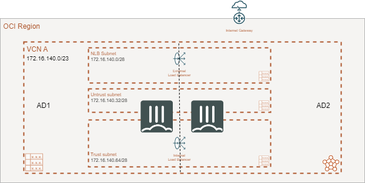
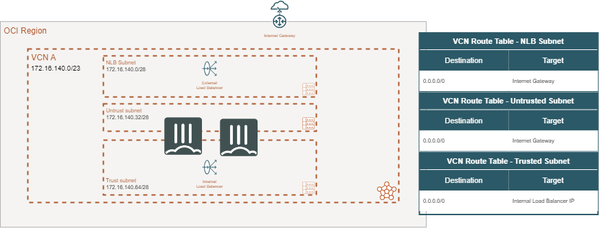

# oci-aa-drg

This Terraform deploy Active/Active FortiGate in Security Services VCN with 3 subnets.

You may run into an issue where cloudinit fails to load the full FortiGate Configuration.  Usually, this happens on the vNICs attached to the instance after initial bootup.  You will need to ssh to the FortiGate and issue the ```exec factoryreset``` command.  This will cause the cloudinit to run again.  When the device comes up, it should be functioning properly:


**Overview**




**Routing**

